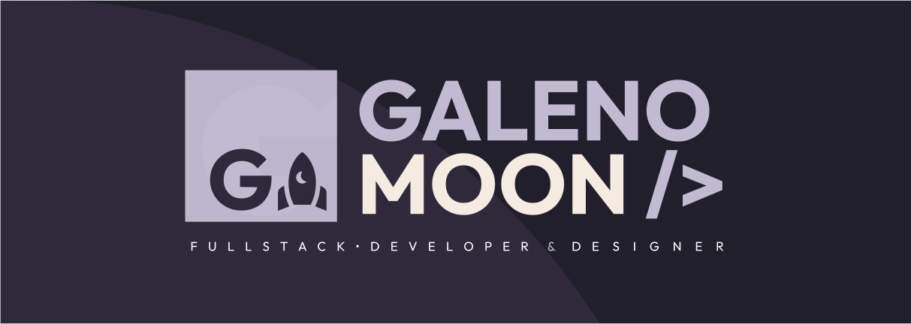

# Welcome to My GitHub Profile! 👋

  

## Hello, I'm Guilherme Galeno! ✨

Welcome to my GitHub profile! I'm a Full-Stack Developer, Team Leader, and UI/UX enthusiast. I have a strong passion for creating captivating web and mobile applications that deliver exceptional user experiences.

## About Me 🙋‍♂️

I'm Guilherme Galeno, a self-taught developer with a focus on Full-Stack web development. With an artistic vision and a love for creativity, I aim to bring unique and visually appealing designs to life.

## Skills and Expertise 🚀

- 💻 Developer Type: Full-Stack
- 🎯 Team Leader: Yes
- 🌍 Languages: English, Portuguese

## Artistic Vision 🎨✨🎵

As a creative individual with an artistic vision, I bring a unique perspective to my work. 🎨 I not only excel in web development but also have a passion for various art forms. I have written songs 🎵 and have experience as a designer, having worked on projects where I developed logos and completed UI/UX designs using Figma. 💡

I believe that this artistic background gives me a keen eye for aesthetics and allows me to create visually stunning and engaging user interfaces. With my diverse skill set, I strive to create web applications that are not only functional but also visually appealing and memorable.

Let's collaborate and create something extraordinary together! 🚀

##

### Coding Languages and Frameworks

- ⚛️ React.js, React Native, Next.js
- 🐍 Python
- 💎 Ruby

### Frameworks and Libraries

- 💻 ReactDOM, Tailwind CSS, Styled Components, Bootstrap
- 📱 React Native
- 🚂 Rails
- 🎨 SASS/SCSS

### Databases

- 🗄️ SQL, NoSQL

### Deployment

- 🌐 Heroku, Vercel, AWS

### Tools

- 🛠️ Git, GitHub, Linux, VScode, Figma, Google Colab

### Learning

- 📚 Python, TensorFlow, TypeScript

### Education

1. 🎓 Anhanguera - Software Engineering
2. 🎓 Estacio de Sá - Information Systems

## Projects and Achievements 🏆

#### 🌐  Web Portfolio
Welcome to my web portfolio! Here, you'll find a collection of projects showcasing my skills as a web developer specializing in Next.js and Tailwind CSS. Explore my portfolio and discover the range of projects highlighting my creativity and technical expertise.

Visit my portfolio: [Click Here!](https://www.galenomoon.com)

Feel free to get in touch for collaborations or potential opportunities. Contact information is available on my portfolio website.

Thank you for visiting, and I look forward to connecting with you!

#### 🏠 Obraminha
Obraminha is a successful freelancer project I've worked on with over 500 users. I handled the complete frontend development, showcasing my expertise in UI/UX design and frontend development.

Learn more about Obraminha: [Click Here!](https://www.obraminha.com.br)

#### 📱 Life Cell

Life Cell is a project I created—a landing page designed to help my dad improve the sales of his Smartphone Maintenance course. This project allowed me to combine my skills in UI/UX design and frontend development to create an engaging and informative website.

To learn more about Life Cell, please visit the website: [Click Here!](https://www.lifecell.vercel.app/)

## How to Reach Me 📫

If you have any questions, collaboration opportunities, or just want to connect, feel free to reach out to me through the following channels:

- 📧 Email: galeno.dev@gmail.com
- 💼 LinkedIn: [Guilherme Galeno Sena](https://www.linkedin.com/in/guilherme-galeno-sena)
- 🌐 Website: [Check my Portifolio!](https://www.galenomoon.com)

I am always excited to connect with fellow developers and designers, so don't hesitate to get in touch!

